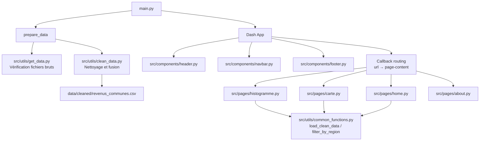

# Inégalités de revenus par commune en France (2002)

Dashboard interactif explorant la distribution et la géographie des revenus
fiscaux de référence des communes françaises, à partir des données publiques DGFiP.

---

## User Guide

### Prérequis
- Python 3.11 ou supérieur
- pip

### Installation

```bash
git clone <adresse_du_depot>
cd data_project
python -m venv .venv
# Linux/macOS :
source .venv/bin/activate
# Windows :
.venv\Scripts\activate
pip install -r requirements.txt
```

### Lancement

```bash
python main.py
```

Ouvrir [http://127.0.0.1:8050](http://127.0.0.1:8050) dans un navigateur.

Le dashboard génère automatiquement les données nettoyées au premier lancement.

### Pages disponibles

| Page | URL | Description |
|---|---|---|
| Accueil | `/` | KPIs et navigation |
| Histogramme | `/histogramme` | Distribution du RFR moyen, filtre région + nb classes |
| Carte | `/carte` | Scatter map géolocalisé, 3 variables disponibles |
| À propos | `/about` | Sources, technologies, installation |

---

## Data

| Fichier | Source | Description |
|---|---|---|
| `data/raw/ircom-communes-revenus-2002.xlsx` | [DGFiP / data.gouv.fr](https://www.data.gouv.fr/fr/datasets/impot-sur-le-revenu-par-commune/) | Revenus fiscaux de référence par tranche et par commune (36 000+ communes) |
| `data/raw/communes-france-2025.csv` | [data.gouv.fr](https://www.data.gouv.fr/fr/datasets/communes-de-france-base-des-codes-postaux/) | Référentiel géographique des communes (coordonnées GPS, population, région…) |
| `data/cleaned/revenus_communes.csv` | Généré automatiquement | Fusion et nettoyage des deux sources ci-dessus |

La jointure est faite sur le **code INSEE** à 5 caractères (2 chiffres département + 3 chiffres commune).

---

## Developer Guide

### Architecture du code



## Rapport d'analyse

### Conclusions principales

- **Forte inégalité** : le RFR moyen par foyer varie de ~2 100 € à ~189 000 € selon les communes.
- **Distribution asymétrique** : la grande majorité des communes se situe entre 8 000 € et 20 000 €, avec une longue queue vers les hauts revenus.
- **Concentration géographique** : les communes à forts revenus se concentrent en Île-de-France, sur la Côte d'Azur et dans les grandes métropoles.
- **Médiane nationale** : ~13 650 € par foyer fiscal, significativement inférieure à la moyenne (~15 800 €), ce qui confirme l'asymétrie de la distribution.

---

## Copyright

Je déclare sur l'honneur que le code fourni a été produit par moi-même,
à l'exception des lignes ci-dessous :

| Lignes | Source | Explication |
|---|---|---|
| — | — | — |

Toute ligne non déclarée ci-dessus est réputée être produite par l'auteur du projet.
